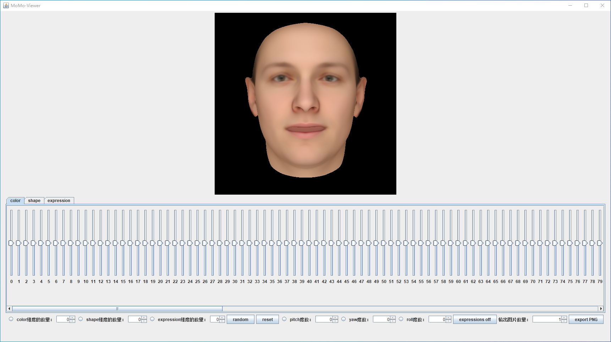

# 3D Face generation model
3D face generation model original from Basel face project, I made some modifications for our job.

This model is from the simple tool to view the [Basel Face Model 2019](https://faces.dmi.unibas.ch/bfm/bfm2019.html) (compatible with the Basel Face Model 2017 and 2009).

 
## Usage:
 
 
 
- the radio button of 'color' 'shape' 'expression' dimensions used to control whether include the dimension in the model to generate face 
- the spinner which follows those dimension labels controls the number of parameters in each dimension
- the button 'random' will produce a new random face based on those selected dimensions 
- the button 'reset' will update all model parameters
- the radio button of 'yaw' 'pitch' and 'roll' will control the angle of the face, the angle is from -180 to 180.
- the button 'expressions off' will control the expression dimension tab showing or hiding
- the spinner 'number of export images and button 'export PNG' can generate images as you set.

## Requirements
- installed [Java](http://www.oracle.com/technetwork/java/javase/downloads/index.html) (Version 8.0 or higher recommended)
- installed [sbt](http://www.scala-sbt.org/release/tutorial/Setup.html) (only for compiling from sources)
 

## For Developers:
- clone repository
- compile and run using `sbt run -mem 2000 console`

## Tips
1.安装java 此处选择版本为8 ，安装后配置系统环境变量，复制后面字符串到编辑环境变量内新增变量 
变量名 
'JAVA_HOME'  
变量值 
'C:\Program Files\Java\jdk1.8.0_341'
'C:\Program Files\Java\jdk1.8.0_341\bin'
'C:\Program Files\Java\jdk1.8.0_341\jre\bin'

2.安装Scala 此处选择版本为3.2.0 ，安装后配置系统环境变量，复制后面字符串到编辑环境变量内
'%SCALA_HOME%\bin'
此处顺序要在java环境之后

3.安装sbt 下载sbt-1.7.1.msi后直接安装
此处环境变量要在java之前

4.命令行进入项目文件，在该文件夹下运行'sbt run -mem 2000 console'

5.三维面孔数据源于Basel Face Model 
